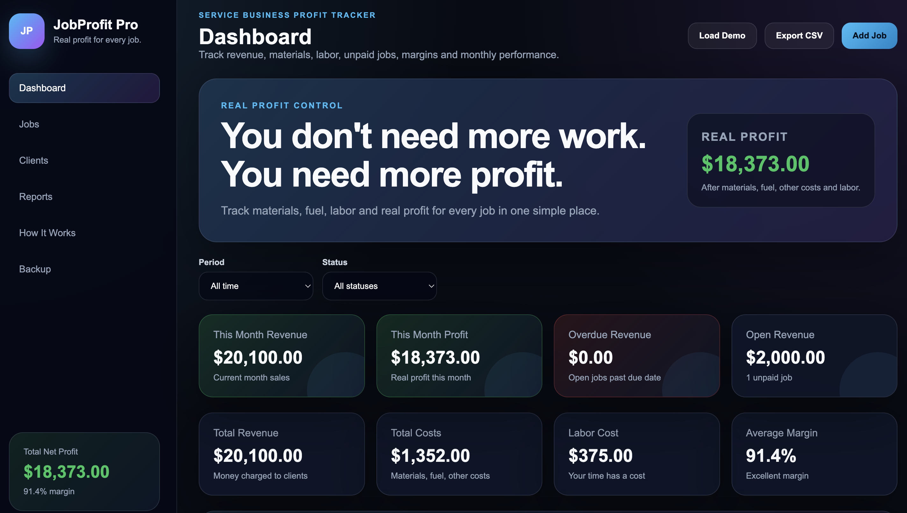
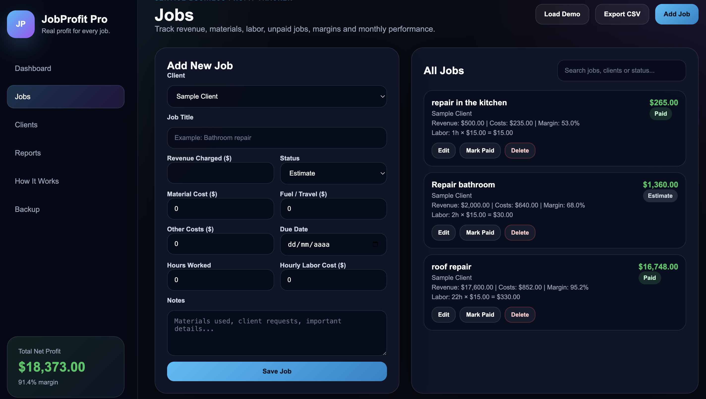
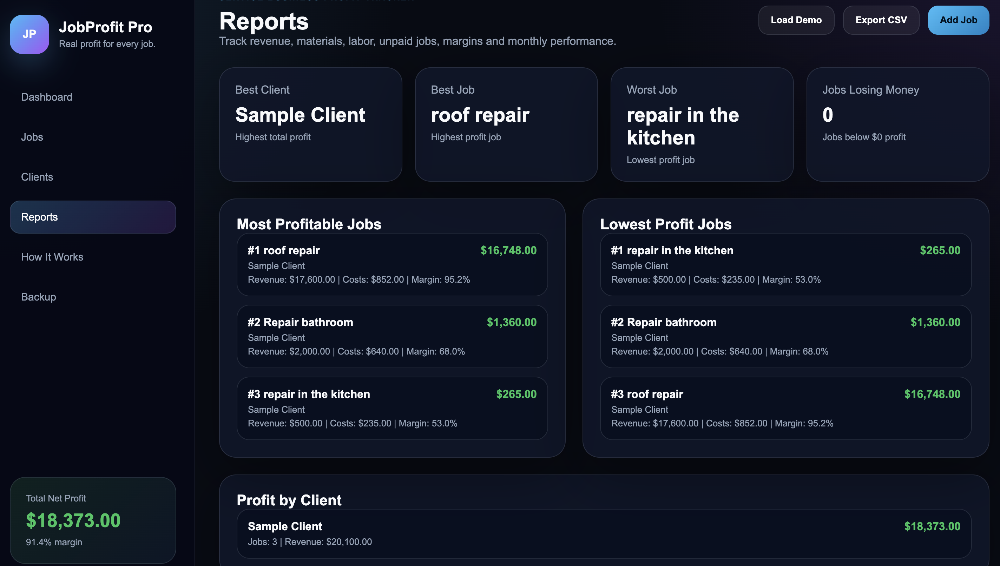

# JobProfit Pro

Business management dashboard designed for freelancers, entrepreneurs and service providers.

## Live Demo

🚀 Live Application:

https://magnificent-truffle-533a35.netlify.app/

## Overview

JobProfit Pro helps users manage jobs, track revenue, control expenses and monitor business profitability through a simple and intuitive dashboard.

The application was developed to provide a practical solution for independent professionals and small businesses that need better financial visibility and performance tracking.

## Features

- Revenue tracking
- Expense management
- Profit analysis
- Client management
- Job management
- Financial reports
- Local data storage
- Responsive interface
- Backup and restore functionality

## Technologies

- HTML5
- CSS3
- JavaScript
- LocalStorage

## Screenshots

### Dashboard



### Jobs



### Reports



## Purpose

The goal of this project is to help freelancers, entrepreneurs and service providers organize their business operations, monitor profitability and make data-driven decisions.

## Future Improvements

- Cloud database integration
- User authentication
- PDF report generation
- Advanced analytics
- Multi-user support
- Mobile application version
- API integrations

## Installation

1. Clone the repository

```bash
git clone https://github.com/antgabrielcamargo-hub/jobprofit-pro.git
```

2. Open the project folder

3. Run `index.html` in your browser

No additional installation is required.

## Project Status

✅ Active

✅ Public Portfolio Project

✅ Live Demo Available

## Author

**Gabriel Camargo**

Front-End Developer focused on:

- Business Dashboards
- CRM Systems
- Inventory Management Applications
- Business Automation Tools

GitHub Profile:

https://github.com/antgabrielcamargo-hub

---

If you found this project interesting, feel free to explore the code, test the live demo and share your feedback.
